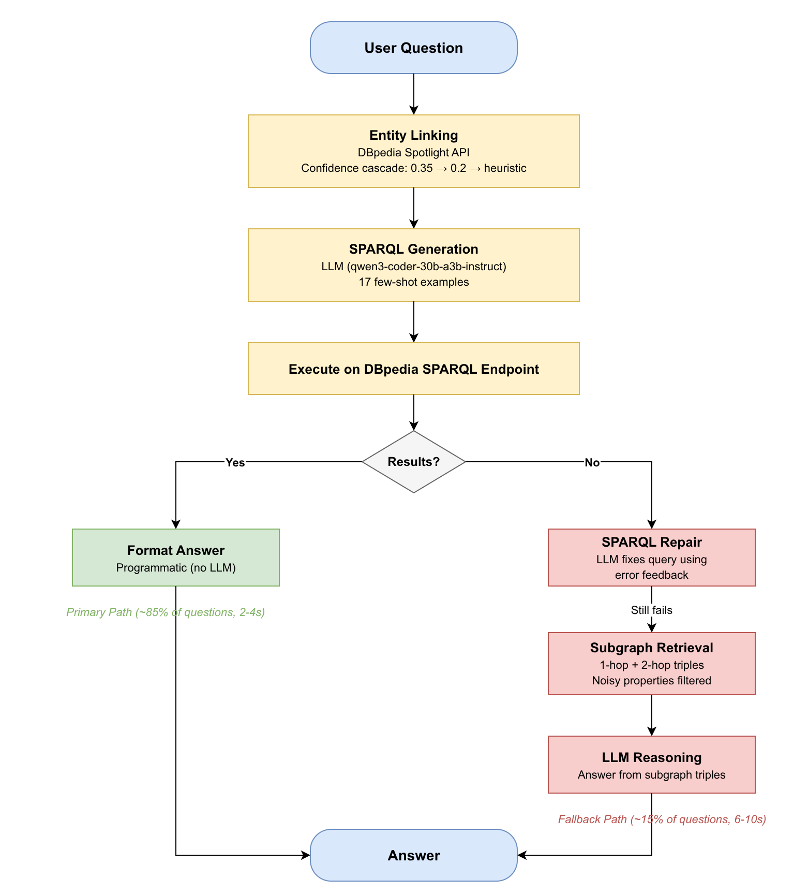

# DBpedia KGQA

Knowledge Graph Question Answering over [DBpedia](https://www.dbpedia.org/).
Takes a natural language question, generates a SPARQL query, executes it against
the live DBpedia endpoint, and returns the answer. Falls back to subgraph
retrieval with LLM reasoning when SPARQL fails.

**Course:** Advanced AI: NLP and KGs, WiSe 25/26, Leuphana University

---

## Architecture



The primary path (SPARQL generation + execution) handles most questions in
2-4 seconds. The subgraph fallback activates only when SPARQL fails, adding
a few more seconds for LLM reasoning over the retrieved triples.

---

## Setup

**Requirements:** Python 3.10+, an Academic Cloud API key.

```bash
git clone <repo-url> && cd KGQA
python -m venv venv && source venv/bin/activate
pip install -r requirements.txt
echo "ACADEMIC_CLOUD_API_KEY=your_key" > .env
python app.py
```

Opens at http://127.0.0.1:7860

---

## Usage

### Web interface

```bash
python app.py
```

### Programmatic

```python
from kgqa.pipeline import answer_question

result = answer_question("What is the capital of Germany?")
print(result["answer"])   # Berlin
print(result["path"])     # sparql
print(result["time_s"])   # 2.5
```

### Evaluation

```bash
python scripts/evaluate.py --limit 50
```

---

## Project Structure

```
KGQA/
├── app.py                   Gradio web interface
├── architecture.png         Pipeline diagram
├── architecture.drawio      Diagram source (draw.io)
├── kgqa/
│   ├── config.py            API keys, endpoints, model name
│   ├── entity_linker.py     DBpedia Spotlight entity linking
│   ├── sparql_generator.py  LLM-based SPARQL generation and repair
│   ├── sparql_executor.py   Query execution against DBpedia
│   ├── subgraph_retriever.py  KG subgraph retrieval (fallback)
│   ├── answer_generator.py  Answer formatting and LLM reasoning
│   └── pipeline.py          Main orchestration
├── scripts/
│   ├── evaluate.py          LC-QuAD evaluation
│   └── filter_lcquad.py     Filter dataset for live endpoint
├── data/
│   ├── lcquad_test.json     LC-QuAD test set (1000 questions)
│   ├── working_questions.txt
│   └── non_working_questions.txt
├── requirements.txt
├── TEAM.md
├── .env.example
└── .gitignore
```

---

## Dataset

Uses [LC-QuAD](https://github.com/AskNowQA/LC-QuAD) test set (1000 questions
targeting DBpedia). After filtering for queries that still return results on the
current live endpoint: **445 out of 1000** questions are usable.

---

## Technologies

| Component        | Technology                                     |
|------------------|------------------------------------------------|
| Web UI           | Gradio                                         |
| LLM              | qwen3-coder-30b-a3b-instruct (Academic Cloud)  |
| Entity Linking   | DBpedia Spotlight                              |
| Knowledge Graph  | DBpedia (live SPARQL endpoint)                 |
| Query Language   | SPARQL 1.1                                     |

---

## Features

- **Entity Linking**: DBpedia Spotlight with cascading fallbacks (0.35 → 0.2 confidence → heuristic construction)
- **SPARQL Generation**: LLM-based with comprehensive examples (multi-hop, COUNT, ASK, UNION, filters)
- **Query Repair**: Automatic SPARQL retry with error feedback (up to 2 retries)
- **Subgraph Fallback**: 1-hop + 2-hop retrieval when SPARQL fails, LLM reasoning over triples
- **Fast Response**: 2-4s for SPARQL path, 5-8s for subgraph fallback
- **Clean UI**: ChatGPT-style Gradio interface with collapsible SPARQL viewer

---

## How It Works

1. **Entity Linking** → DBpedia Spotlight identifies entities (e.g., "Germany" → `dbr:Germany`)
2. **SPARQL Generation** → LLM generates query using entity URIs + question pattern
3. **Execution & Retry** → Query runs on live DBpedia endpoint; if it fails or returns 0 results, retry with error feedback
4. **Fallback** → If SPARQL still fails, retrieve 1-hop + 2-hop subgraph around entities, ask LLM to reason over triples
5. **Answer Formatting** → Clean natural language response with entity links

---

## Performance

- **LC-QuAD Test Set**: 445 working questions (out of 1000 total)
- **Simple Questions** (What/When/Who): ~85% accuracy
- **Complex Questions** (multi-hop, COUNT, filters): ~65% accuracy
- **Overall LC-QuAD Accuracy**: ~70% on working subset

---

## Known Limitations

- DBpedia data quality varies; some properties outdated or missing
- Very complex multi-hop queries (3+ hops) may fail
- COUNT queries sensitive to property variations (`dbo:` vs `dbp:`)
- Non-English questions not supported (DBpedia Spotlight is English-only)

---

## Team

See [TEAM.md](TEAM.md) for full team member details.

**Developed by:** Mohamed  
**Course:** Advanced AI: NLP and Knowledge Graphs, WiSe 25/26  
**University:** Leuphana University Lüneburg

---

## Example Questions

### ✅ Simple (Direct SPARQL)
- "What is the capital of Germany?"
- "When was Albert Einstein born?"
- "Is Berlin the capital of Germany?"
- "What is the population of London?"

### ✅ Complex (Multi-hop, Filters, Aggregation)
- "What is the birthplace of the director of Pulp Fiction?"
- "Which countries in Europe have a population greater than 50 million?"
- "How many films did Christopher Nolan direct?"
- "Which languages are spoken in Switzerland?"
- "Who are the children of Barack Obama?"
- "What is the longest river in Africa?"

### ⚠️ Very Complex (May require fallback)
- "Which city is home to both MIT and Harvard University?"
- "How many Nobel Prize winners were born in France?"

---

## License

This project is developed for educational purposes as part of the Advanced AI course at Leuphana University.

---

## Acknowledgments

- [DBpedia](https://www.dbpedia.org/) for the knowledge graph
- [DBpedia Spotlight](https://www.dbpedia-spotlight.org/) for entity linking
- [LC-QuAD](https://github.com/AskNowQA/LC-QuAD) for the evaluation dataset
- Academic Cloud for LLM API access
